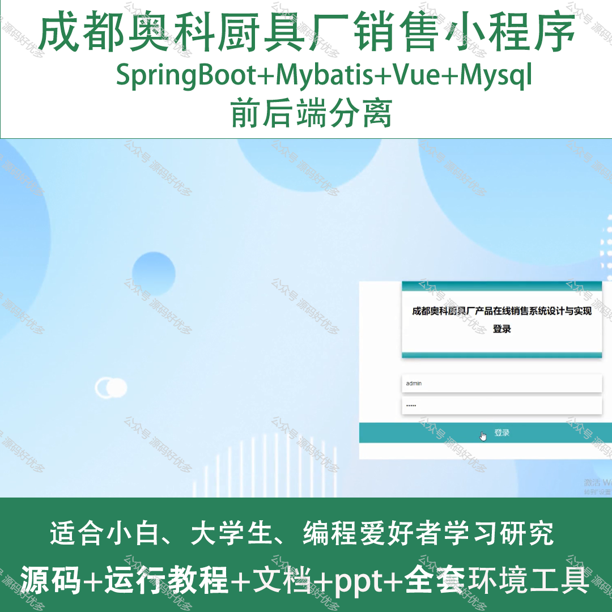
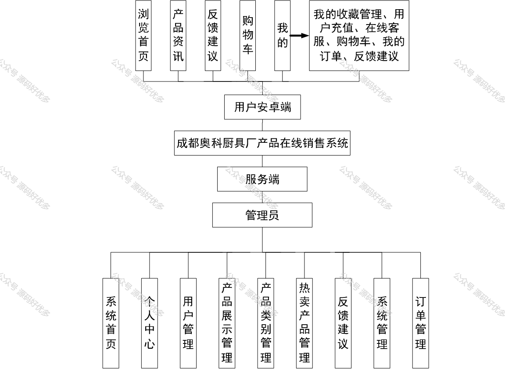
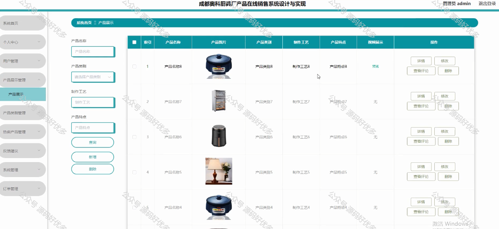
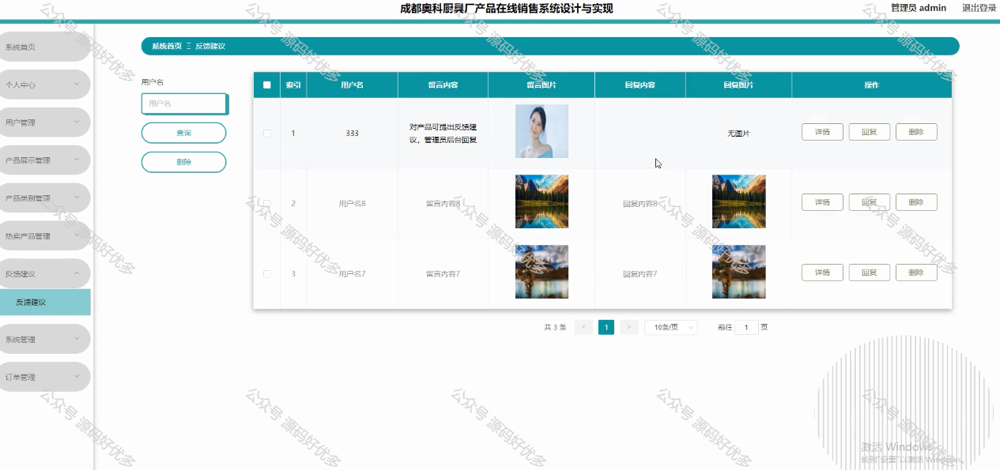
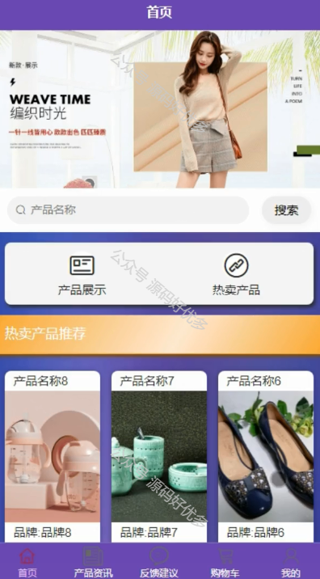
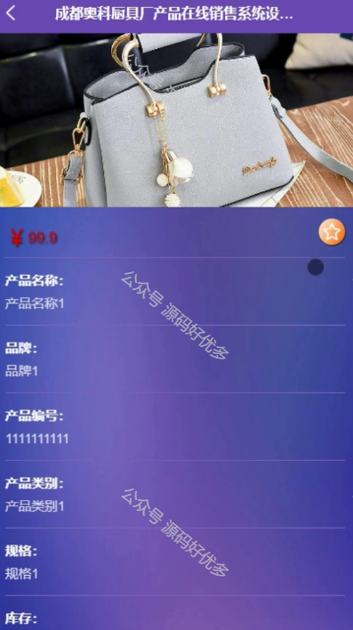
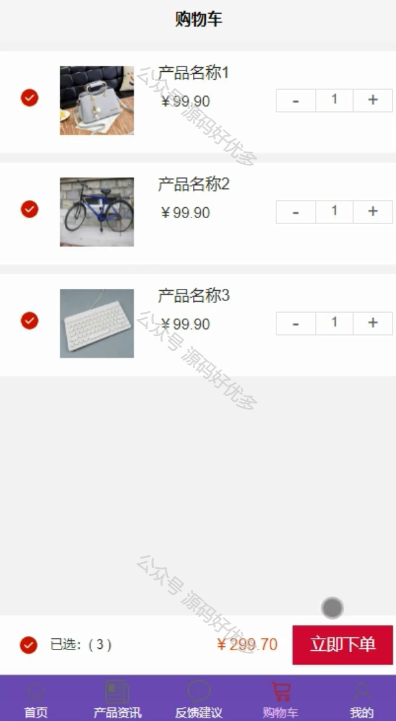
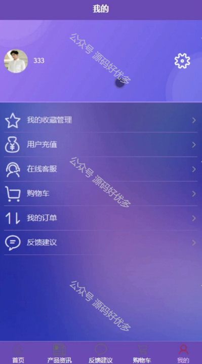
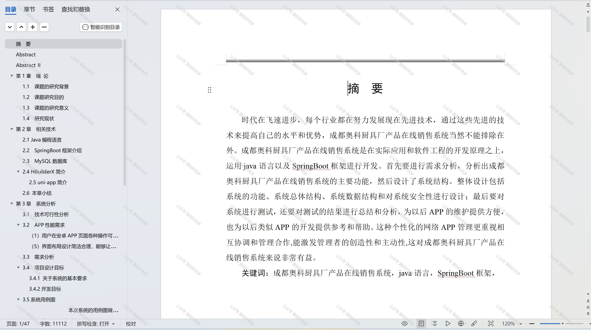

 
## 查看主页获取源码

> **作者介绍**： **✌**全网粉丝10W+本平台特邀作者、博客专家、CSDN新星计划导师、java领域优质创作者,博客之星、掘金/华为云/阿里云/InfoQ等平台优质作者、专注于项目实战 **✌**

  

### 一、作品包含

源码+数据库+设计文档万字+PPT+全套环境和工具资源+部署教程

### 二、项目技术

前端技术：Html、Css、Js、Vue、Element-ui

数据库：MySQL

后端技术：Java、Spring Boot、MyBatis

  

### 三、运行环境

开发工具：IDEA/eclipse + 微信开发者工具

数据库：MySQL5.7

数据库管理工具：Navicat10以上版本

环境配置软件： JDK1.8+Maven3.6.3

前端Nodejs：14

### 四、项目介绍
项目编号：mpweixinA017

"成都奥科厨具厂销售微信小程序"是一款为厨具销售行业量身定制的线上服务平台。它以成都奥科厨具厂的产品为核心，为消费者和经销商提供了一个便捷的厨具选购渠道。通过小程序，用户可以浏览最新的厨具产品、了解产品详情、进行在下单购买。这款小程序的推出，不仅拓宽了奥科厨具的销售网络，也提升了品牌的市场竞争力，同时为用户提供了更加高效、便捷的购物体验。

前台用户功能：浏览首页、产品资讯、反馈建议、购物车和我的收藏管理、用户充值、在线客服、购物车、我的订单、反馈建议。

后台管理员的功能：系统首页、个人中心、用户管理、产品展示管理、产品类别管理、热卖产品管理、反馈建议、系统管理和订单管理。

### 五、运行截图

  
